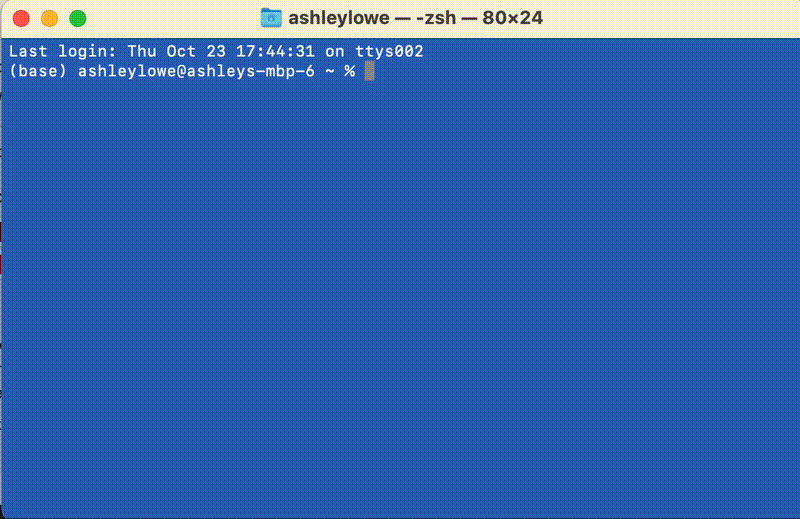
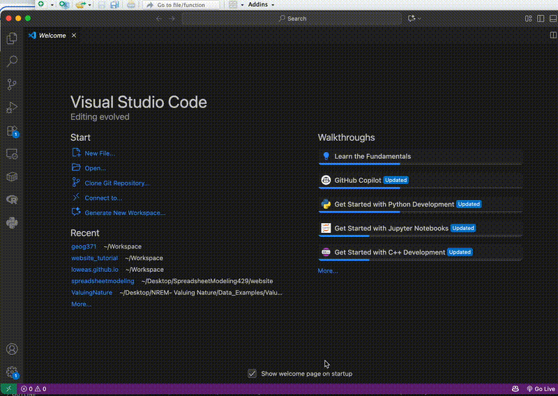
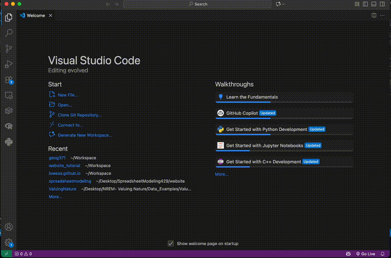
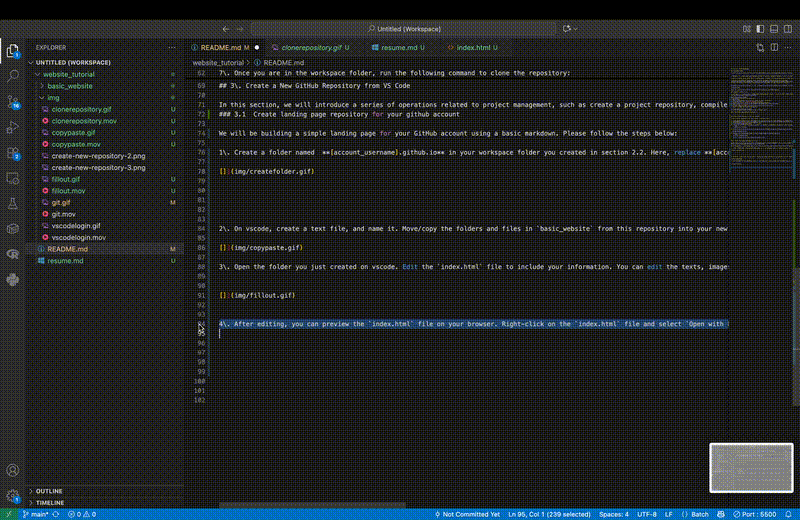
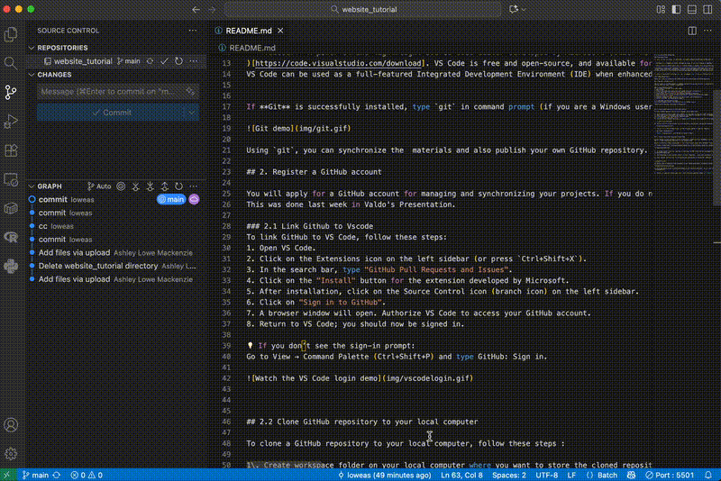
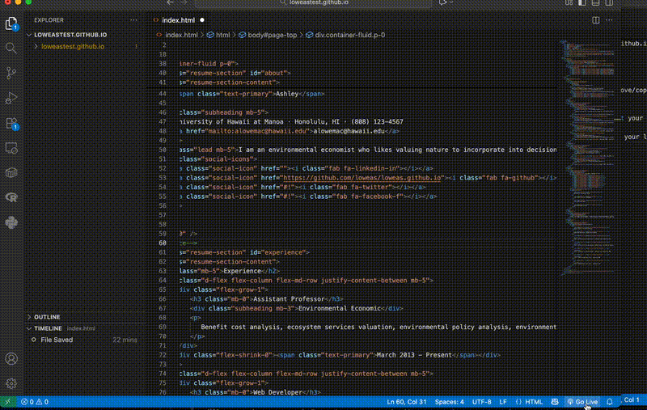

# Set up your github landing page

## 1 Environment Setup

For this, you will use chrome, git and vscode. Also these software products have already been installed in the lab computers. But I highly recommend you to install all these three.


- **Chrome:** is a freeware web browser developed by Google. It was first released on September 2, 2008 for Microsoft Windows, and was later ported to Linux, macOS, iOS and Android. Google Chrome is also the main component of Chrome OS, where it serves as a platform for running web apps. **Click [here](install-chrome.md) to see a demo on how to install Google Chrome**;

- **Git:** A version control system (VCS) for tracking changes in computer files and coordinating work on those files among multiple people ([Click here to download](https://git-scm.com/downloads)). It is primarily used for source-code management in software development, but it can be used to keep track of changes in any set of files.  Git was created by **Linus Torvalds** in 2005 for development of the Linux kernel, with other kernel developers contributing to its initial development. Its current maintainer since 2005 is Junio Hamano.

- **vscode:** A powerful and lightweight source code editor developed by Microsoft (Click here to download
)[https://code.visualstudio.com/download]. VS Code is free and open-source, and available for Windows, macOS, and Linux. It provides built-in support for debugging, syntax highlighting, intelligent code completion, snippets, version control integration, and extensions.
VS Code can be used as a full-featured Integrated Development Environment (IDE) when enhanced with extensions.


If **Git** is successfully installed, type `git` in command prompt (if you are a Windows user) or terminal (if you are a Mac or Linux user), the following screen will be shown up.



Using `git`, you can synchronize the  materials and also publish your own GitHub repository.  

## 2. Register a GitHub account

You will apply for a GitHub account for managing and synchronizing your projects. If you do not have a GitHub account yet, please sign up at [https://www.github.com](https://www.github.com). Notably, you will need to choose a username. It is worth noting that, **this username will be used as a part of the domain name of your home github ['username'.github.io](). So, make sure this username is succinct, simple and English-character only. Apparently, an easily-recognized domain name is more popular.**
This was done last week in Valdo's Presentation.

### 2.1 Link Github to Vscode
To link GitHub to VS Code, follow these steps:
1. Open VS Code.
2. Click on the Extensions icon on the left sidebar (or press `Ctrl+Shift+X`).
3. In the search bar, type "GitHub Pull Requests and Issues".
4. Click on the "Install" button for the extension developed by Microsoft.
5. After installation, click on the Source Control icon (branch icon) on the left sidebar.
6. Click on "Sign in to GitHub".
7. A browser window will open. Authorize VS Code to access your GitHub account.
8. Return to VS Code; you should now be signed in.   

💡 If you don’t see the sign-in prompt:
Go to View → Command Palette (Ctrl+Shift+P) and type GitHub: Sign in.




## 2.2 Clone GitHub repository to your local computer

To clone a GitHub repository to your local computer, follow these steps :

1\. Create workspace folder on your local computer where you want to store the cloned repository. For example, you can create a folder named `workspace` in your user directory.

2\. Open GitHub in your web browser and navigate to the repository you want to clone. For example, you can go to [loweas/website_tutorial](https://github.com/loweas/website_tutorial)

3\. Click the green "Code" button on the repository page.

4\. Copy the URL provided under "HTTPS".

5\. You can use your terminal (Mac/Linux) or command prompt (Windows) and navigate to the workspace folder you created in step 1. You can use the `cd` command to change directories
    ```
    cd path/to/your/workspace
    ```
6\. You can also use VS Code terminal to do the same thing. Open VS Code, and open the workspace folder you created in step 1. Then open the terminal in VS Code by going to View > Terminal.

    

7\. Once you are in the workspace folder, run the following command to clone the repository:
    ```
    git clone  <repository-url>
    ```
    Replace `<repository-url>` with the URL you copied in step 4. 


## 3\. Create a New GitHub Repository from VS Code

In this section, we will introduce a series of operations related to project management, such as create a project repository, compile a markdown file, and upload files to GitHub, and at last, publish a repository. As a practice, we will build a GitHub repository for your online resume. To see an integrated demo of this section, please check [here](repo-git.md).

### 3.1\.  Create landing page repository for your github account


We will be building a simple landing page for your GitHub account using a basic markdown. Please follow the steps below:

1\. Create a folder named  **[account_username].github.io** in your workspace folder you created in section 2.2. Here, replace **[account_username]** with your actual GitHub username. For example, if your GitHub username is `loweas`, then the folder name should be `loweas.github.io`.




2\. On vscode, create a text file, and name it. Move/copy the HTML files from this downloaded file to your new created landing page. This file contains a simple HTML template for your landing page with bootstrap applications. There are a ton of more templates here: https://startbootstrap.com/themes/. Another great sites I found the OA Template : https://themewagon.com/theme-price/free/


3\. Once everything is moved you will need to edit your `index.html`.  Vsode makes everything very visual to better for you to edit. You can change the title, headings, paragraphs, links, and images to reflect your personal information. Next you will want to look at the live application before you push so Right-click on the `index.html` file and select `Open with Live Server`. If you do not have the Live Server extension installed, you will be prompted to install it.
**Note this video shows where you can manually install live server**



4\. After editing, save the file. You can preview your landing page by opening the `index.html` file in a web browser. Make sure everything looks good.




5\. Now you need to initialize a Git repository in your landing page folder. Nevigated to source control tab on vscode and click on `Initialize Repository`.


6\. After you publish it got to github and navigate to the repository published. You will need to make the repository public if you want it to be seen by everyone. Go to `Settings` > `Manage Access` > `Change repository visibility` and select `Public`.


7\. After making the repository public, go to the `Settings` tab of your repository. Scroll down to the "GitHub Pages" section. Under "Source", select the branch you want to use (usually `main` or `master`) and click "Save". Your site will be published at `https://[account_username].github.io/`.


8\. Finally, to view your landing page, go to `https://[account_username].github.io/`. Replace `[account_username]` with your actual GitHub username. You should see your landing page live on the web!